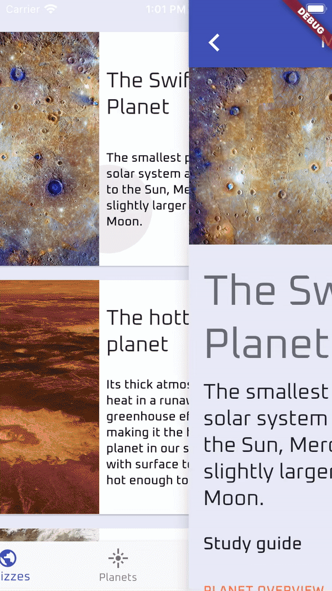
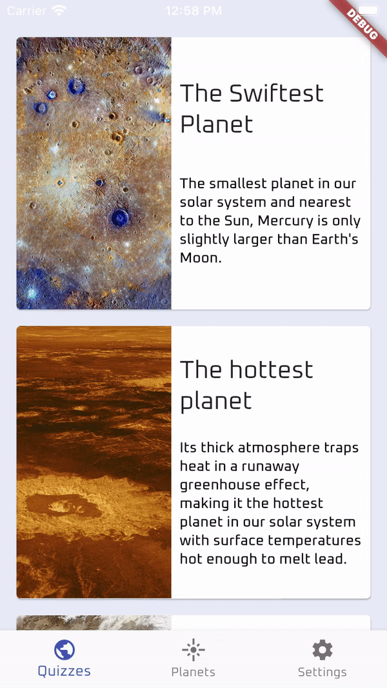

# Pylot

A app of planets that are in our solar system. This app displays a list of quizzes of the solar system, also has a list of planets where you can study from it. There are themes preferences and animations preferences that are stored to the user.

## Pre-requisites

Flutter installed.  
SDK version: 2.1.0 or higher.

## Getting Started

Download the project. 
Go to your project location from the terminal.  
Run (make sure to have an open simulator/emulator or your phone). THIS VERSION IS NOT AVAILABLE FOR WEB.  
``
flutter pub get  
``
  
``
flutter run 
``  
Enjoy :). 

## App Preview

    <table>
        <tr>
            <td style="text-align: center">
                    
            </td>            
            <td style="text-align: center">
                    
            </td>  
            <td style="text-align: center">
                    
            </td>  
    </table>

